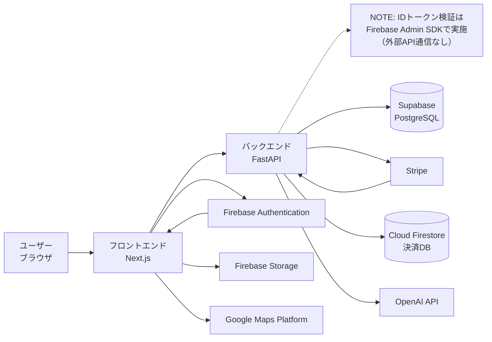

```mermaid
flowchart LR
  User[ユーザー<br/>ブラウザ]

  FE[フロントエンド<br/>Next.js]
  BE[バックエンド<br/>FastAPI]

  Auth[Firebase Authentication]
  DB[(Supabase<br/>PostgreSQL)]
  Storage[Firebase Storage]
  Firestore[(Cloud Firestore<br/>決済DB)]

  Stripe[Stripe]
  OpenAI[OpenAI API]
  Maps[Google Maps Platform]

  %% 基本導線
  User --> FE
  FE --> BE

  %% 認証（ログイン/トークン取得）
  FE --> Auth
  Auth --> FE

  %% 認可（トークン検証）はBE内部で完結（注釈）
  Note1["NOTE: IDトークン検証は<br/>Firebase Admin SDKで実施<br/>（外部API通信なし）"]
  BE -.-> Note1

  %% 業務データ
  BE --> DB

  %% 画像
  FE --> Storage

  %% 地図
  FE --> Maps

  %% 決済
  BE --> Stripe
  Stripe --> BE
  BE --> Firestore

  %% AI
  BE --> OpenAI

```
