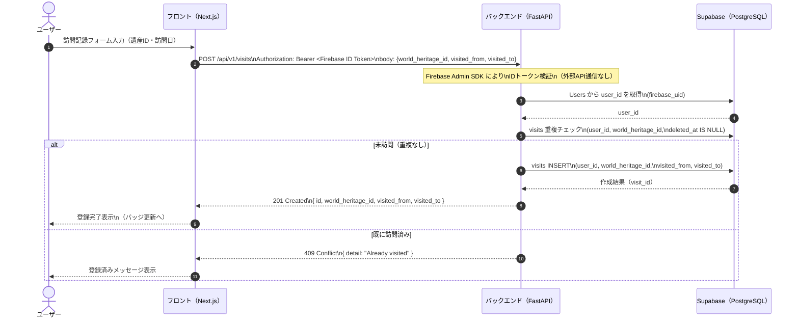

```mermaid
sequenceDiagram
    autonumber
    actor U as ユーザー
    participant FE as フロント（Next.js）
    participant BE as バックエンド（FastAPI）
    participant DB as Supabase（PostgreSQL）

    U->>FE: 訪問記録フォーム入力（遺産ID・訪問日）

    FE->>BE: POST /api/v1/visits\nAuthorization: Bearer <Firebase ID Token>\nbody: {world_heritage_id, visited_from, visited_to}

    Note over BE: Firebase Admin SDK により\nIDトークン検証\n（外部API通信なし）

    BE->>DB: Users から user_id を取得\n(firebase_uid)
    DB-->>BE: user_id

    BE->>DB: visits 重複チェック\n(user_id, world_heritage_id,\ndeleted_at IS NULL)

    alt 未訪問（重複なし）
        BE->>DB: visits INSERT\n(user_id, world_heritage_id,\nvisited_from, visited_to)
        DB-->>BE: 作成結果（visit_id）
        BE-->>FE: 201 Created\n{ id, world_heritage_id, visited_from, visited_to }
        FE-->>U: 登録完了表示\n（バッジ更新へ）
    else 既に訪問済み
        BE-->>FE: 409 Conflict\n{ detail: "Already visited" }
        FE-->>U: 登録済みメッセージ表示
    end
```
